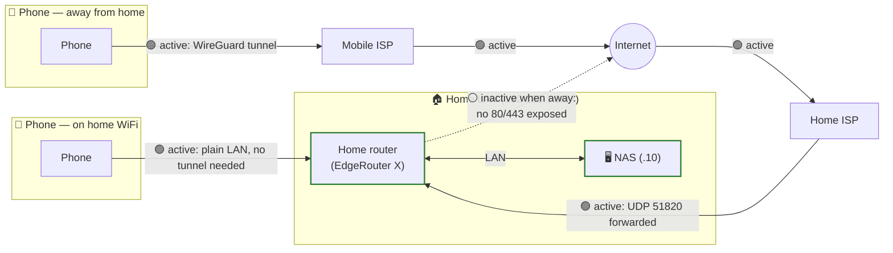

# Network topology

How the phone actually reaches the NAS, in both situations — home LAN and away. Extends [ARCHITECTURE.md](ARCHITECTURE.md)'s "Network exposure" decision (LAN + WireGuard, no public hostname) with the concrete path each hop takes. Hardware/router specifics are the separate `~/code/resources/hardware/` repo's authority (see [DEPLOY.md](DEPLOY.md)) — this diagram is the shape, not a new source of truth for device specs.

## Reading this

- **Home Wi-Fi**: phone → router → NAS, all on the LAN, no WireGuard involved at all — the plain, common case.
- **Away from home**: phone's own WireGuard client dials out over whatever network it's on (mobile data — its own ISP), crosses the public internet, reaches the home ISP, and the home router forwards the WireGuard port (UDP `51820`) to the NAS — same tunnel mechanism already set up for Joakim's own remote SSH access (see the hardware repo's network doc). Two independent ISPs are genuinely in the path here (mobile carrier + home broadband), which is what makes this "away" case different from the LAN case, not just a longer version of it.
- **What's deliberately inactive**: no `80`/`443` forwarded to the NAS at all, in either scenario — per [ARCHITECTURE.md](ARCHITECTURE.md)'s no-public-hostname decision. The dashed line above is what a public-facing setup (like the now-obsolete `photos.reuterborg.se`) *would* have used; the NAS design deliberately never opens it.

## Not yet real

This diagram describes the intended shape, not a live status view — there's no NAS app running yet to actually report "active/inactive" in real time. A future PWA status screen ([UX_FLOWS.md](UX_FLOWS.md)) could show this same topology with genuinely live state (is the tunnel actually up right now), but that depends on the NAS existing first.

## Status

Sketched 2026-09-07, alongside the LAN+WireGuard exposure decision.
